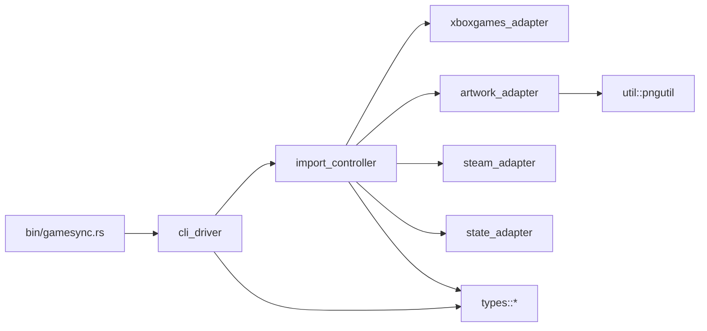
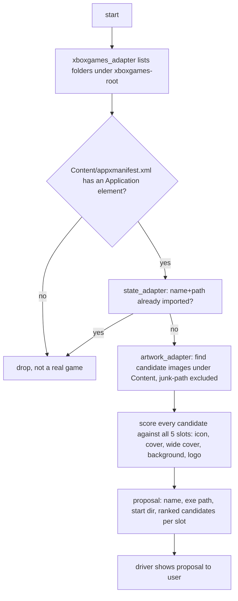
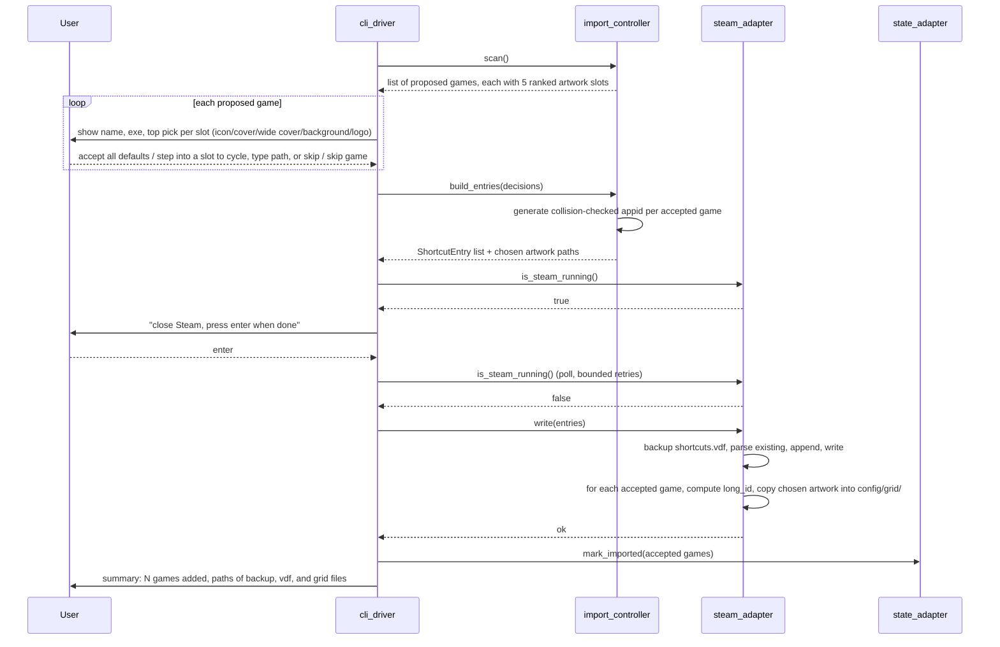

# Design: gamesync import flow

## Layers

| Module | Layer | Responsibility |
|---|---|---|
| `adapter::xboxgames_adapter` | adapter | scan `C:\XboxGames`, parse each `Content\appxmanifest.xml`, return raw facts per folder |
| `adapter::artwork_adapter` | adapter | walk a game's `Content\` tree for candidate image files (broad, junk-path-excluded), read each one's width/height/alpha flag |
| `adapter::steam_adapter` | adapter | find `userdata\<id>`, detect `steam.exe`, read/backup/write `shortcuts.vdf`, place `config/grid/<long_id><suffix>.png` files |
| `adapter::state_adapter` | adapter | read/write `import-state.json` |
| `controller::import_controller` | controller | decide real game vs stub, score artwork candidates per slot, dedupe against state, generate `appid`, build shortcut entries + chosen artwork, merge with existing shortcuts |
| `driver::cli_driver` | driver | interactive review loop (accept-all-defaults or step into a slot), close-Steam wait, final confirm. Kept and tested, **not shipped as a binary** — `GameSync.exe` is the only deliverable |
| `driver::gui_driver` (Windows only) | driver | the shipped app: `eframe`/`egui` window, same review-and-confirm flow as `cli_driver`, mouse-driven instead of keyboard-driven |
| `types::*` | types | `Game`, `ManifestFacts`, `ShortcutEntry`, `VdfValue`, `GridImageSpec`, `ArtworkCandidate`, `ImportState`, `ImportedGameRecord` |
| `util::pngutil` | util | pure IHDR width/height/alpha parser |

Interfaces (`XboxGamesRepository`, `ArtworkFinder`, `SteamShortcuts`,
`ImportStateStore`) are traits declared beside their concrete impl in each
adapter file, consumed by `import_controller` through constructor injection.
`cli_driver` depends only on `import_controller`'s trait, never touches an
adapter directly.

## Design diagram



## Data flow diagram — scan and propose



## Sequence diagram — review through write



## Real-game vs stub decision

Confirmed against the user's actual `C:\XboxGames` this session:
`Call of Duty`, `Forza Horizon 6`, `Frostpunk 2- PC Edition`,
`Persona 5 Royal` all have `<Application Id="..."
Executable="GameLaunchHelper.exe" ...>` inside `Content\appxmanifest.xml`.
`BO7 DLC01 Game Stub 01` (and its two siblings) and `GameSave` do not — the
stub manifests have `<Properties>`/`<Dependencies>`/`<Resources>` only, no
`<Applications>` block at all.

`xboxgames_adapter` does a plain substring/regex check for an `<Application`
tag with an `Executable=` attribute inside `appxmanifest.xml` — this is
adapter-level fact extraction (parse, don't decide). `import_controller`
turns that fact into an include/exclude decision. A folder with no
`Content\appxmanifest.xml` at all (e.g. `GameSave`) is dropped by the adapter
before it ever becomes a fact, since there is nothing to parse.

Exe path is always `Content\gamelaunchhelper.exe` (case-insensitive match on
disk; Steam's own `Exe` field will be written with the on-disk casing).
Start dir is always `Content\`.

## Artwork candidates and ranking

Candidates: every image file (`*.png`, `*.jpg`, `*.jpeg`) under `Content\`,
depth-capped at 4 levels below `Content\`, **excluding by path shape, not by
filename keyword**. Real Xbox package art is never named "cover" or "hero"
or "background" — the actual filenames found across all four real games
surveyed this session are `StoreLogo.png`, `Square150x150Logo.png`,
`WideLogo.png` (480×480, square despite the name), `SplashScreen.png`
(1920×1080), `GraphicsLogo.png`, `MediumLogo.png`. Keyword-filtering input
candidates against Steam's category names would find nothing, so it isn't
done. What must be excluded instead is unrelated asset dumps that happen to
sit under `Content\`: Forza Horizon 6 ships 90+ engineering-diagram JPGs
under `Content\media\physics\suspension\legacy\` (suspension geometry
references, not game art) — excluded by that path prefix, confirmed present
this session via a full directory walk.

**A denylist of known junk folder names is not enough.** Confirmed the hard
way against the real `C:\XboxGames`: Call of Duty ships a genuine bulk
game-data folder, `Content\cod25\main\`, that isn't named anything a generic
list could anticipate, and took **75.7 seconds** to enumerate on its own
(measured from WSL against the real install). Two structural fixes, not more
name-guessing:
1. `artwork_adapter::walk` carries a hard 4-second wall-clock deadline for
   the whole per-game walk, checked before every directory read and inside
   every entry loop, logged when it triggers.
2. Within any one directory, every direct file is scored before any
   subdirectory is recursed into. Confirmed necessary, not just sufficient:
   a first version with only the time budget made Call of Duty return **zero**
   candidates, because the budget was consumed entirely inside `cod25` before
   the walk ever got back to `Content\`'s own `SplashScreen.png`. Files-first
   guarantees shallow real assets are always collected before time is spent
   on deep bulk data, matching what every real game surveyed this session
   actually looks like: art assets sit shallow, junk sits deep.

For each candidate, `util::pngutil` reads the 8-byte PNG signature and the
`IHDR` chunk: width (bytes 16-19, big-endian u32), height (bytes 20-23,
big-endian u32), and color type (byte 25 — values `4` and `6` indicate an
alpha channel) — no chunk-by-chunk decode needed since `IHDR` is always the
first chunk. JPEGs are accepted as candidates (both real games' splash
screens are PNG in practice, but the format allows JPEG) with a JPEG
SOF0/SOF2 marker scan for width/height and no alpha support.

Every candidate is scored against **all 5 slots** (not bucketed by name):

| Slot | Ideal size | Where the winner is written |
|---|---|---|
| Shortcut icon | roughly square, ≥256×256 preferred | `shortcuts.vdf` `icon` field |
| Cover | 600×900 (portrait) | `config/grid/<long_id>p.png` |
| Wide Cover | 920×430 | `config/grid/<long_id>.png` |
| Background | 3840×1240 | `config/grid/<long_id>_hero.png` |
| Logo | 1280 wide or 720 tall, no fixed aspect | `config/grid/<long_id>_logo.png` |

Score per candidate per slot = aspect-ratio closeness to the slot's ideal
(primary key), then resolution adequacy — prefer meeting or exceeding the
ideal over upscaling something small (secondary key) — with alpha-channel
presence adding a small bonus for the Logo slot only. The same file can be
the top pick for more than one slot (e.g. `SplashScreen.png` at 1920×1080 is
the best available match for both Background and, by default, the only
option for Cover, despite being a poor portrait fit) — ranking never
assumes one file maps to one slot.

No real game surveyed this session ships a portrait/tall image, so Cover
frequently has no good candidate. When the top score for a slot is below a
"weak match" threshold, the driver still shows the best candidate but
labels it as a weak match rather than presenting it as confident, and always
offers skip. This matches the pattern the user already chose by hand for the
`icon` field: `WideLogo.png` and `StoreLogo.png` were both present for Forza
and Persona, and the existing entries use the wide/store logo, not a small
square one — the ranking presents a top candidate but the user still
confirms or cycles per slot, so a wrong default costs one keypress, not a
mistake.

## Steam Customization grid artwork (Cover / Wide Cover / Background / Logo)

Separate from the `icon` field inside `shortcuts.vdf`, Steam's per-game
Customization page reads four more images as plain files in
`userdata/<id>/config/grid/`, named from a 64-bit ID derived from the
shortcut's own `appid`:

```
long_id = (appid as u32 as u64) << 32 | 0x02000000
```

Confirmed this session (read-only: a public gist on converting shortcut
appids to "Long Shortcut AppIDs", corroborated by `SteamGridDB
/steamgriddb-manager` PR #136, which fixes exactly this case for
manually-added shortcuts — use the appid **already present** in
`shortcuts.vdf`, never recompute one independently). Since `steam_adapter`
is the one writing `appid` in the first place (see below), it always knows
the exact value and can compute `long_id` without depending on Steam or any
network lookup.

Filenames: `<long_id>p.png` (Cover), `<long_id>.png` (Wide Cover),
`<long_id>_hero.png` (Background), `<long_id>_logo.png` (Logo). `grid/`
doesn't exist yet in the user's `userdata` folder (confirmed this session —
they've never used the Customization page's custom-image feature), so
`steam_adapter` creates it on first write. Placing these files is a copy
(source file is never modified or moved), and since they're new additive
files rather than edits to an existing tracked file, no backup step applies
to them the way it does for `shortcuts.vdf`.

## Binary `shortcuts.vdf` format

Reverse-engineered this session from the user's real 845-byte file
(`userdata/392934526/config/shortcuts.vdf`), byte type tags:

| Byte | Meaning |
|---|---|
| `0x00` | start of a nested object (map) — followed by the key, NUL, then children, then a matching `0x08` |
| `0x01` | string value — followed by the key, NUL, then the value, NUL |
| `0x02` | int32 value — followed by the key, NUL, then 4 bytes little-endian |
| `0x08` | end of the current object |

The whole file is itself one more object of this same shape, wrapping the
single `shortcuts` key, closed by its own trailing `0x08` at end of file.
This was gotten wrong on the first implementation pass: an initial read of
the file's `strings` output plus a debug walker that treats any `0x08`
(including one at the true top level) as "stop, done" happened to look
byte-consistent even though it silently swallowed that final marker instead
of flagging it as unexpected. Running the actual codec against the real file
end to end caught it immediately (`unexpected end-of-object marker at root`)
and it's now covered by an explicit regression test.

Confirmed field order per shortcut entry, verified byte-exact this session
with a precise recursive structural walk (not just a `strings` scan, which
had originally missed a field — see below): `appid` (int32), `AppName`,
`Exe`, `StartDir`, `icon`, `ShortcutPath`, `LaunchOptions` (strings, empty
string still written as `0x01 key 0x00 0x00`), `IsHidden`,
`AllowDesktopConfig`, `AllowOverlay`, `OpenVR`, `Devkit` (int32, all `0` for
a normal shortcut), `DevkitGameID` (string, empty), `DevkitOverrideAppID`,
`LastPlayTime` (int32 — a real Unix timestamp when the game has been played,
e.g. `1786994324` for Forza; `0` for a never-played entry like Persona in
the live file), `FlatpakAppID` (string, empty), `sortas` (string, empty —
**caught only by the recursive-walk re-verification**, absent from the
initial `strings`-based transcription), then a nested empty `tags` object
(`0x00 tags 0x00` `0x08`), then `0x08` closing the shortcut. The whole
`shortcuts` object is itself keyed by a stringified index (`"0"`, `"1"`,
...).

`appid`: **not** computed from `Exe`/`AppName`. Tested this session, against
the live file's real bytes, the classic community formula
(`crc32(Exe + AppName) | 0x80000000` cast to `i32`, in both string orders,
with and without forcing the high bit) — none of the four variants match
the real stored values (`-2090050060` for Forza, `-448463598` for Persona).
Corroborated by `ValveSoftware/steam-for-linux#9463` (2023-05-05): Steam's
own non-Steam-game ID "randomizes... every time a NSG is added, even if the
absolute path and executable name are identical" — it stopped being a pure
function of exe+name. `PhilipK/steam_shortcuts_util` (an actively-referenced
Rust crate for this exact task) still bakes in the old formula for this
field, which is now demonstrably stale against real Steam — one more reason
not to depend on it. `steam_adapter` instead generates a random `i32` with
the high bit set (so it has the same shape Steam's own values have) and
checks it doesn't collide with any `appid` already present in the parsed
file. This is sufficient because Steam accepts any value in this field for
a shortcut it didn't create itself, and — importantly — gamesync now needs
this value to be **known and stable**, not matched to Steam's algorithm,
because it's also the seed for the grid-artwork filename (`long_id`, see
below).

`steam_adapter` never blindly overwrites the file: it parses the existing
tree into a `Vec<VdfValue>` of shortcut objects, appends new ones with the
next free numeric key, and re-serializes the whole tree. Existing shortcuts
untouched by this run round-trip byte-identical except for the appended
entries.

## State file

`import-state.json` next to the binary (or `--state-file` override), shape:

```json
{
  "imported": [
    { "name": "Forza Horizon 6", "xboxgames_path": "C:\\XboxGames\\Forza Horizon 6" }
  ]
}
```

A game is "already imported" when both `name` and `xboxgames_path` match an
entry. This also means it needs a first run that records Forza Horizon 6 and
Persona 5 Royal as already-imported without re-adding them to `shortcuts.vdf`
— `import_controller` seeds this by reading the existing `shortcuts.vdf`
entries once on first run (matching `AppName` against the scan) rather than
requiring the user to manually declare them done.

## Steam-running detection

`steam_adapter` shells out to `tasklist /FI "IMAGENAME eq steam.exe" /NH`
(Windows-only, the binary only ever runs on Windows) and checks whether the
output contains `steam.exe`. No `sysinfo` crate needed for one process-name
check.

## GUI (`GameSync.exe`, `driver::gui_driver`)

The user asked for a single deliverable: only the GUI is built and shipped,
named exactly `GameSync.exe`. The earlier plain-CLI binary
(`src/bin/gamesync.rs`, `[[bin]] name = "gamesync"`) is removed from
`Cargo.toml` and `forge.yaml` entirely — `driver::cli_driver` stays in the
tree since it's real, tested, reusable logic and costs nothing to keep, but
nothing builds it into a shipped binary anymore. `Cargo.toml`'s `[[bin]]`
entry is `name = "GameSync"`, `path = "src/bin/gamesync-gui.rs"` — binary
name and source file name don't have to match in cargo, and this keeps the
deliverable capitalized exactly as the user wants.

### Threading (added after the second real freeze report)

`scan` and `import` never run on the GUI thread. `GamesyncGuiApp` holds
`Arc<DefaultImportController>` and `Arc<dyn SteamShortcuts>` (all four
adapter traits gained `Send + Sync` bounds to make this legal); clicking
Scan or Import clones those `Arc`s into a `std::thread::spawn` closure along
with a cloned `egui::Context`, which sends its result back over an
`mpsc::channel` and calls `ctx.request_repaint()` when done so the UI wakes
immediately instead of waiting for the next poll. `Screen::Scanning` and
`Screen::Importing` hold the `Receiver` and poll it non-blockingly
(`try_recv`) each frame, requesting a repaint every 200ms only while that
operation is actually in flight — this is a bounded, purpose-tied repaint,
not the old unconditional-forever one that caused the console-spawn bug.

### Windows Smart App Control (researched this session — no code fix exists)

The user hit Smart App Control blocking the exe. Checked poe-wayfinder (same
workspace, same unsigned-exe situation) for how it handles this: **it
doesn't, programmatically** — confirmed via its own `CLAUDE.md`:

- No code-signing crate, `build.rs`, manifest file, or CI signing step
  anywhere in that workspace.
- Its own README states plainly: "The build is unsigned, so Smart App
  Control may block it."
- Its `CLAUDE.md` documents the actual constraint: SAC allows-by-hash, Rust
  builds aren't reproducible, so a hash that got approved can't be
  regenerated — meaning a *working, already-allowed* exe must never be
  overwritten. Their workaround is deploying hash-named exes
  (`poe-wayfinder-<commit>-<hash>.exe`) and rebuilding (touching a source
  file to shift the hash) to retry the SAC gate, which their notes say
  clears "roughly one in three" attempts.
- They evaluated real code signing and rejected it on cost/availability:
  self-signed doesn't satisfy SAC (needs a cert chaining to the Microsoft
  Root Program); Azure Artifact Signing (~$10/mo) has individual onboarding
  paused, US/Canada orgs only; Sectigo Individual Validation (~$220/yr plus
  a hardware token) was the only route they found open from France.

gamesync has no better option available and doesn't attempt one. Since the
user wants a fixed name (`GameSync.exe`), the hash-named-deploy trick isn't
used — every rebuild overwrites the same file at the same path, so if SAC
already allowed a previous build, a rebuild can invalidate that trust and
require going through the gate again. Practical mitigation documented in
`FOLLOWUP.md`: if a build gets blocked, rebuild once or twice (each rebuild
changes the binary hash even with identical source, since Rust builds
aren't reproducible) and retry — same odds poe-wayfinder reports, no better,
no worse.

### Corrected mid-session: which poe-wayfinder pattern actually applies

The reference the user named, poe-wayfinder, is not
just the plain-terminal CLI that an earlier research pass found — it also
ships a real windowed overlay app built with `egui`/`eframe`
(`poe-wayfinder-app/src/driver/overlay_loop/win.rs`). That's what "the theme
of poe-trader/poe-wayfinder" meant. gamesync mirrors the non-overlay parts of
that pattern: same `eframe`/`egui` version pin (`0.32`, `glow` backend), same
dependency gating (`eframe`/`egui` live under
`[target.'cfg(windows)'.dependencies]` in `Cargo.toml`, so a plain `cargo
build`/`cargo test` on the WSL host never touches GUI code — only cross
-compiling to `x86_64-pc-windows-gnu` pulls it in), same
`#![cfg_attr(windows, windows_subsystem = "windows")]` on the GUI binary so
double-clicking it opens a window with no console flash.

Unlike poe-wayfinder's overlay (transparent, undecorated, always-on-top,
click-through), `GameSync.exe` is an ordinary window: decorated, resizable,
opaque, `900x700` default size — there's no game to overlay on top of, it's
a standalone import tool.

`driver::gui_driver::GamesyncGuiApp` implements `eframe::App`, holding the
same `import_controller::DefaultImportController` and `SteamShortcuts`
instance `driver::cli_driver` also uses — no business logic duplicated, the
GUI is purely a different rendering/input layer over the same controller.
State is an enum (`Setup` → `Reviewing` → `Done`) swapped out each frame via
`std::mem::replace` (the standard immediate-mode pattern for mutating owned
state while `self` is otherwise borrowed).

Screens:
- **Setup**: text fields for the Xbox games folder and Steam folder
  (pre-filled with the real defaults), a button to locate the Steam userdata
  folder (auto-picks if there's exactly one, otherwise shows buttons for
  each candidate), then "Scan for games".
- **Reviewing**: a checkbox per proposed game (checked by default — accepting
  everything is the fast path), a collapsible section per game showing all 5
  artwork slots as a combo box (`egui::ComboBox`) listing every ranked
  candidate by path and measured dimensions plus a "(skip)" option, and an
  "Import N selected game(s)" button — disabled while Steam is running
  (polled every 2 seconds via `poll_steam_running`, shown as an orange
  warning banner) or nothing is selected.
- **Done**: a one-line summary and a "Scan again" button.

Cross-compiled and linted for Windows through two dedicated forge entries
(`gamesync-windows` build stage, `lint-windows` test stage) since the plain
`lint`/`gamesync-host` stages only ever touch the host target, where
`eframe`/`egui` aren't even a dependency — the GUI code only exists once
you're building for `x86_64-pc-windows-gnu`, so it needs its own stages to
actually get checked.

## Open items resolved from scope.md

- Already-imported matching: name + folder path (user confirmed).
- Backup rotation: none in v1, timestamped backups accumulate (scope.md
  non-goal, small file, not worth the complexity).
